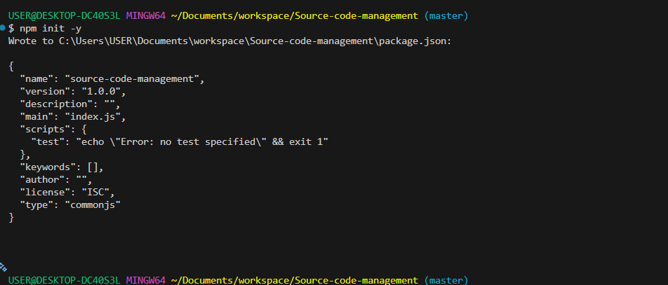
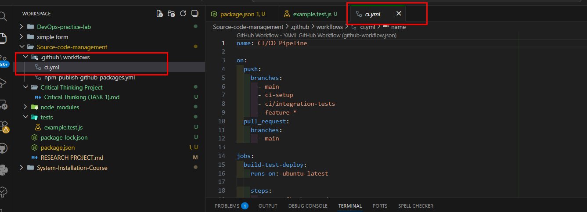
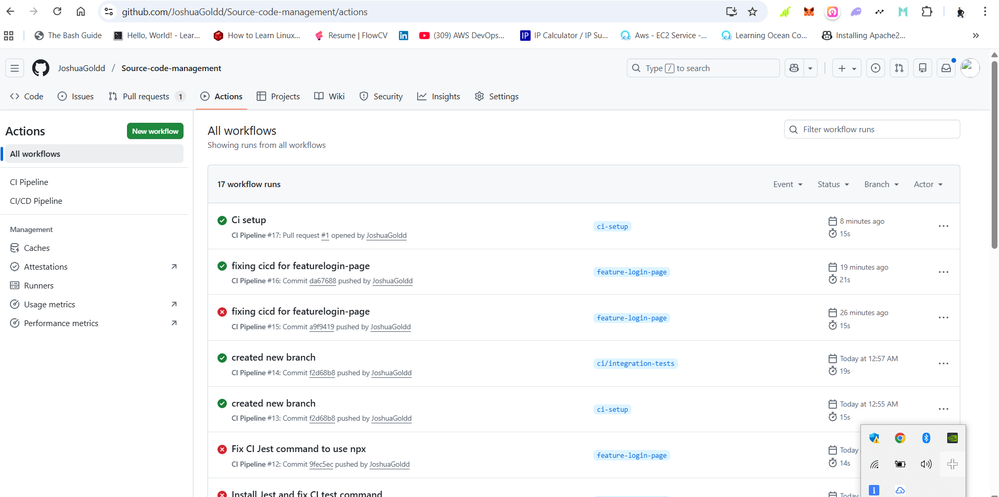
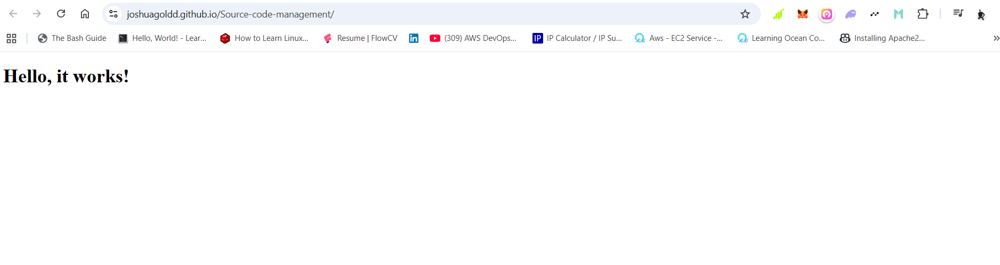

# Automated code quality and deployment

___

## Introduction

In this project, I implemented a **Continuous Integration and Continuous Deployment (CI/CD) pipeline** using **GitHub Actions**. I started the project by **creating my own GitHub repository**, then progressively built automation for **testing, code quality checks, and deployment**.

___

### Tools and Technologies Used

- GitHub Actions – CI/CD automation
- Node.js & npm – Project runtime and package management
- Jest – Unit testing
- ESLint – Code quality and linting
- Git & GitHub – Source code management
- GitHub Pages – Staging deployment environment

For this Task i used GitHub Actions to automate testing, code quality checks, and deployment. It covers the following:

- Running automated tests
- Checking code quality using ESLint
- Deploying to GitHub Pages when checks pass

### When is it triggered?

- On every push to any branch starting with `feature-`.

### What does it do?

1. **Checks out the code.**
2. **Runs unit tests (simulated).**
3. **Checks code quality (simulated).**
4. **If all pass, deploys to a staging environment (simulated).**

### How to use

- Create a feature branch: `git checkout -b feature-login-page`
- Push to GitHub: `git push origin feature-login-page`
- GitHub Actions will take over.

___

## Step 1: Create a GitHub Repository (Project Starting Point)

Right there at the starting point, I created a dedicated GitHub repository to serve as the foundation of the project named `Source code management`.

### What I did

1. Logged into GitHub
2. Clicked **New Repository**
3. Gave the repository a name
4. Chose **Public** visibility
5. Initialized the repository with a **README.md**

This repository became the central place where:

* All code changes are tracked
* GitHub Actions runs automatically
* Deployment is triggered

I then cloned the repository locally:

```bash
https://github.com/JoshuaGoldd/Source-code-management.git
cd <repo-name>
```

This ensured my local environment and GitHub repository were properly connected from the beginning.

___

## Step 2: Initial Project Setup

After cloning the repository i created above, I initialized a Node.js project to manage dependencies and scripts.

```bash
npm init -y
```

This created the `package.json` file, which GitHub Actions later used to install dependencies and run commands automatically.



___

## Step 3: Implementing Unit Testing

### Installing Jest

To ensure my code works correctly, I installed Jest for unit testing:

```bash
npm install --save-dev jest
```

I added the test script to `package.json`:

```json
"scripts": {
  "test": "jest"
}
```

___

### Writing Tests

I created a folder for tests:

```bash
mkdir tests
```

Example test file:

```js
function sum(a, b) {
  return a + b;
}

test("adds two numbers correctly", () => {
  expect(sum(2, 3)).toBe(5);
});
```

I verified the tests locally:

```bash
npm test
```

This step gave me confidence that my logic worked before automation.

___

## Step 4: Enforcing Code Quality with ESLint

To keep the code clean and consistent, I configured ESLint.

```bash
npm init @eslint/config
```

During setup, I selected:

* JavaScript
* Node.js environment
* Recommended rules

I added a linting script:

```json
"scripts": {
  "lint": "eslint ."
}
```

Then ran it locally:

```bash
npm run lint
```

This step ensures that code quality issues are detected early.

___

## Step 5: Setting Up GitHub Actions (CI/CD Automation)

To automate testing, linting, and deployment, I created a GitHub Actions workflow.

### Creating the workflow directory

```bash
mkdir -p .github/workflows
```

### Creating the workflow file

File location:

```bash

.github/workflows/ci-cd.yml
.github/workflows/ci.yml
```

Workflow configuration:

I added sample workflow scripts to my repository by creating ci-cd.yml and ci.yml in the .github/workflows/ directory. These files define the CI/CD pipeline for my project. Once pushed to GitHub, they enable automated steps for:

- Checking out the code
- Setting up Node.js
- Installing dependencies
- Running ESLint for code quality
- Running Jest tests for functionality
- Deploying to the staging environment if all checks pass

This setup allows me to automate testing and deployment for feature branches, providing a proper staging environment and ensuring code quality before merging into the main branch.

Once this file was committed, GitHub Actions became active automatically.



___

## Step 6: Branching and Daily Development Workflow

I used feature branches to keep work organized and safe.

```bash
git push origin master
git push origin ci-setup
git push origin ci/integration-tests
git push origin feature-login-page
```

Each push triggered the CI/CD pipeline automatically, without any manual action from me.



___

## Step 7: Pull Requests and Controlled Merging

To merge changes into the `master` branch, I followed this workflow:

1. Pushed my working branch, i used ci-setup branch to create pull request
2. Opened a pull request on GitHub
3. Reviewed the changes
4. Waited for all CI checks to pass
5. Merged only after successful validation

This process prevented broken or untested code from entering `master`.


___

## Step 8: Deploying to Staging Using GitHub Pages

After successful testing and linting, I deployed the project to **GitHub Pages**.

Steps:

1. Opened **Repository Settings**
2. Navigated to **Pages**
3. Selected:

   * Branch: `ci-setup`
   * Folder: `/ (root)`
4. Enabled HTTPS
5. I accessed the live staging link provided by GitHub

This allowed me to verify the project in a real environment. After visiting the staging link for my project, I initially encountered a 404 error. This occurred because the ci-setup branch did not contain an index.html file, which is required by GitHub Pages to serve a website.

To resolve this, I added a minimal index.html file with some simple content to the root of the ci-setup branch. Once committed and pushed, the website became accessible and fully functional at the provided GitHub Pages URL



___

## Results and Key Outcomes

* I created and managed my own GitHub repository
* I automated testing and linting using GitHub Actions
* I enforced quality checks before merging
* I deployed to GitHub Pages as a staging environment
* I built a CI/CD pipeline that is easy to reproduce and maintain

___

## Conclusion

By starting from repository creation and gradually introducing automation, I built a CI/CD pipeline that is simple, reliable, and stress-free to use. Every step is automated, and every change is validated before deployment, aligning with real-world DevOps best practices.

___
